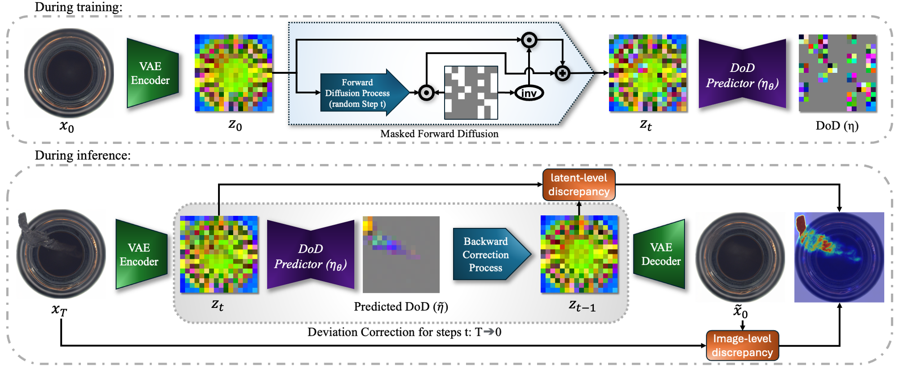
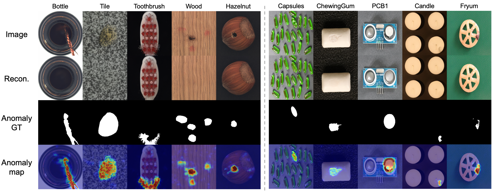

# ✨ DeCo-Diff ✨
**A PyTorch Implementation for Multi-Class Unsupervised Anomaly Detection**

This repository hosts the official PyTorch implementation for our CVPR 2025 paper:  
[**"Correcting Deviations from Normality: A Reformulated Diffusion Model for Unsupervised Anomaly Detection"**.](https://arxiv.org/abs/2503.19357)

---

## 🎨 Approach




---

## 🚀 Getting Started

### 🛠️ Environment Setup

We utilize **Python 3.11** for all experiments. To install the necessary packages, simply run:

```bash
pip3 install -r requirements.txt
```

### 📁 Datasets

You can download the datasets from the links below:
- [MVTec-AD](https://www.mvtec.com/company/research/datasets/mvtec-ad)
- [VisA](https://amazon-visual-anomaly.s3.us-west-2.amazonaws.com/VisA_20220922.tar)


---

## 🏋️ Training

Train our model using the following command. This command sets up the RLR training with various options tailored to your dataset and desired augmentations:

```bash
torchrun train_DeCo_Diff.py \
            --dataset mvtec \ #mvtec or visa
            --data-dir /path/to/dataset \
            --model-size UNet_L \
            --object-category all  \
            --image-size 288 \
            --center-size 256 \
            --center-crop True
```

---

## 🧪 Testing

Once the model is trained, test its performance using the command below:

```bash
python evaluation_DeCo_Diff.py \
            --dataset mvtec \ #mvtec or visa
            --data-dir /path/to/dataset \
            --model-size UNet_L \ #trained model size
            --object-category all  \
            --anomaly-class all  \
            --image-size 288 \
            --center-size 256 \
            --center-crop True \
            --model-path /path/to/pretrained_weights.pt
```
---

## 📦 Pretrained Weights

For convenience, we provide pretrained weights for DeCo-Diff (UNet_L). These weights can be used for rapid inference and further experimentation:

- **MVTec-AD Pretrained Weights:**  
  Download from [Google Drive](https://drive.google.com/file/d/1ZuPD9x_HYyylY2DlCtl0PRi5UZyn0XAL/view?usp=share_link) 
  
- **VisA Pretrained Weights:**  
  Download from [Google Drive](https://drive.google.com/file/d/1bZvzIyuEMWxIo8ZByP9us--OhTTPXYiA/view?usp=sharing) 


Also, using pretrained model with imagenet could slightly boost the performance and ribustness. You could download provided pretrained model provided by [LDM repository](https://github.com/CompVis/latent-diffusion?tab=readme-ov-file) from [here!](https://ommer-lab.com/files/latent-diffusion/cin.zip). 
To use the pretrained model, set `--from-scratch` to `False` and specify the path to the downloaded checkpoint using `--pretrained`.

---

## 📊 Results

Below are the performances of DeCo-Diff on the MVTec-AD and VisA datasets using the best trained models (provided weights). These results illustrate the high efficacy of DeCo-Diff in detecting anomalies in a multi-class UAD setting. Please note that these results differ slightly from those reported in the paper and are slightly better, as they were obtained using an optimized set of training parameters.


|**Dataset**  |I-**AUROC**| I-**AP** |I-**f1max**|P-**AUROC**| P-**AP** |P-**f1max**|P-**AUPRO**|
|-------------|-----------|----------|-----------|-----------|--------|-----------|-----------|
| MVTec-AD   |    99.2    |   99.7   |   98.7    |   98.8    |  76.8  |   71.1    |   95.1    |
| VisA       |    96.2    |   97.0   |   92.6    |   98.3    |  57.5  |   56.4    |   91.5    |

---

## 📸 Sample Results

Below are some sample outputs showcasing the performance of DeCo-Diff on real data:



---

## 📚 Citation & Reference

If you find DeCo-Diff useful in your research, please cite our work:

```bibtex
@inproceedings{beizaee2025correcting,
  title={Correcting deviations from normality: A reformulated diffusion model for multi-class unsupervised anomaly detection},
  author={Beizaee, Farzad and Lodygensky, Gregory A and Desrosiers, Christian and Dolz, Jose},
  booktitle={Proceedings of the Computer Vision and Pattern Recognition Conference},
  pages={19088--19097},
  year={2025}
}
```
